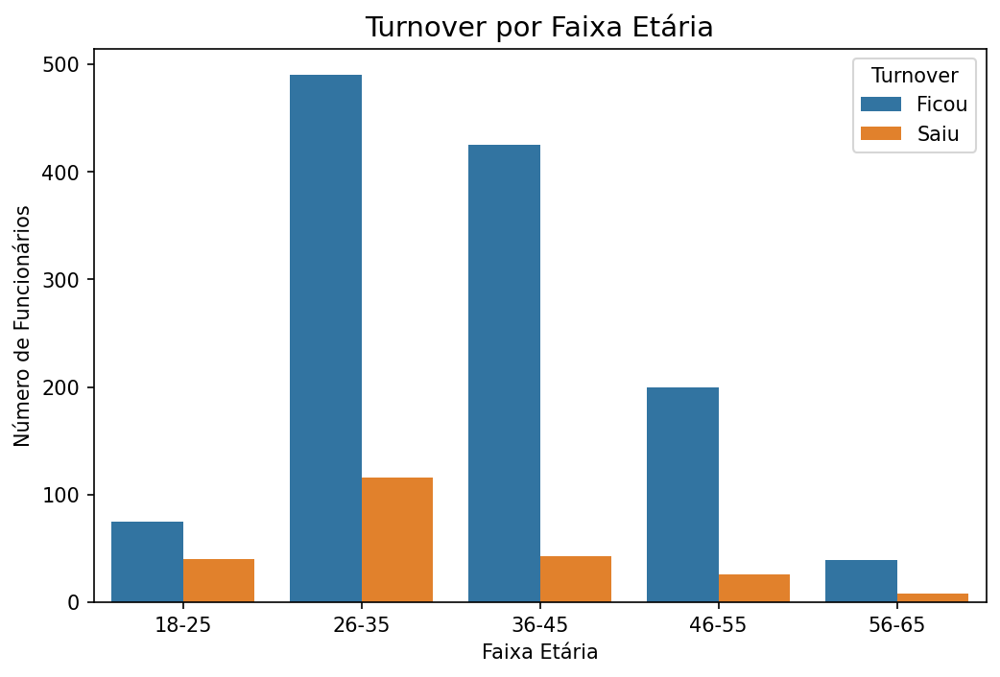
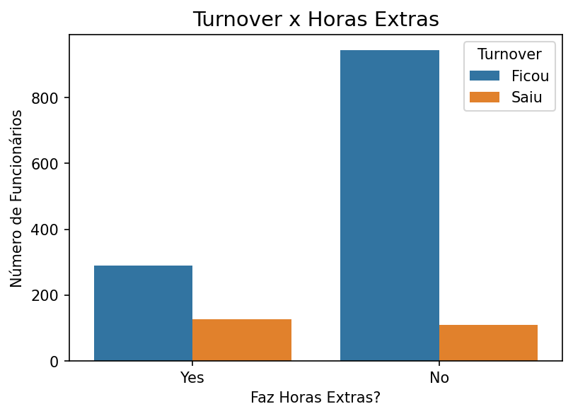
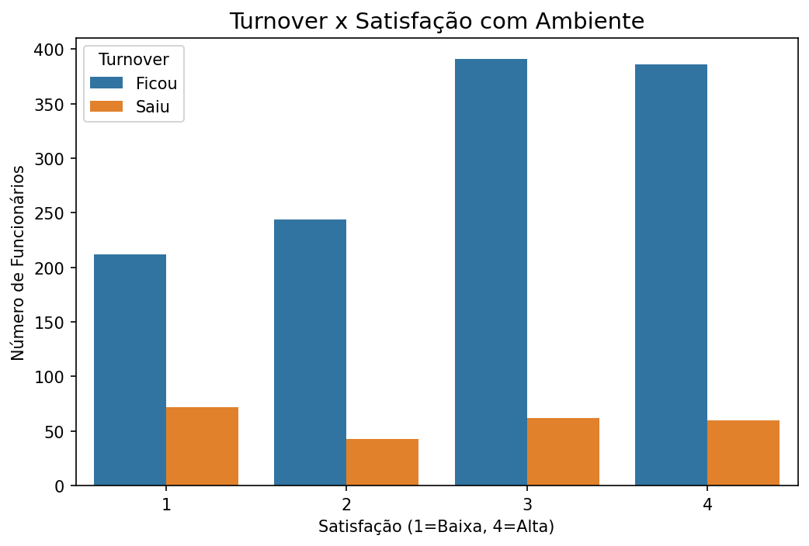

# 📊 Projeto 3: People Analytics - Análise de Turnover e Satisfação


---

## 📋 **Descrição do Projeto**

Este é o **terceiro projeto** do meu portfólio de análise de dados. O objetivo foi analisar os fatores que influenciam a rotatividade de funcionários (turnover) utilizando a base **IBM HR Analytics**.

**Base de dados:** 1.470 funcionários, 35 variáveis, incluindo dados demográficos, satisfação, horas extras, tempo de empresa, etc.

---

## 🎯 **Principais Insights**

### 🔴 **Fatores de Maior Risco**

| Fator | Impacto | Insight |
|-------|---------|---------|
| **Idade (18-25 anos)** | 34.8% de turnover | Jovens têm **4x mais chance** de sair |
| **Primeiros 2 anos** | 28.9% de turnover | Período mais crítico da jornada |
| **Insatisfação com ambiente** | ~25% de turnover | Satisfeitos têm **5x menos** chance de sair |
| **Horas extras** | 30.5% de turnover | Quem faz hora extra tem **3x mais** chance de sair |

### 🟢 **Fatores de Menor Risco**

| Fator | Impacto | Insight |
|-------|---------|---------|
| **Idade 36-45 anos** | 9.2% de turnover | Fase mais estável da carreira |
| **11-20 anos de empresa** | 6.7% de turnover | Maior estabilidade após adaptação |
| **Alta satisfação (nível 4)** | ~5% de turnover | Ambiente positivo retém talentos |

---

## 📈 **Visualizações**

### Turnover por Idade


### Turnover por Horas Extras


### Turnover por Satisfação com Ambiente


---

## 📁 **Estrutura do Projeto**

- **WA_Fn-UseC_-HR-Employee-Attrition.csv** - Base de dados original
- **analise_turnover.ipynb** - Notebook com toda a análise
- **README.md** - Documentação do projeto
- **.gitignore** - Arquivos ignorados pelo Git


---

## 🛠️ **Tecnologias Utilizadas**

- **Python** - Linguagem principal
- **Pandas** - Manipulação de dados
- **Matplotlib / Seaborn** - Visualizações
- **Jupyter Notebook** - Análise interativa
- **Git / GitHub** - Versionamento

---

## 🚀 **Como Executar**

1. **Clone o repositório**
   ```bash
   git clone https://github.com/mayconaap/people-analytics-turnover.git

2. **Acesse a pasta**
    ```bash
    cd people-analytics-turnover

3. **Abra o Jupyter Notebook**
    ```bash
    jupyter notebook analise_turnover.ipynb

4. **Execute as células em sequenciamento**

---

## 💡 **Recomendações para o RH**

**Para jovens (18-25 anos)**
- Criar programa de desenvolvimento acelerado
- Oferecer mentoria com profissionais experientes
- Estabelecer plano de carreira claro

**Para primeiros 2 anos de empresa**
- Implementar programa de integração estruturado
- Realizar feedbacks frequentes (a cada 90 dias)
- Acompanhar desempenho e adaptação

**Para insatisfação com ambiente**
- Realizar pesquisas de clima regularmente
- Treinar lideranças para uma gestão mais próxima
- Implementar ações de melhoria baseadas nos resultados

**Para horas extras excessivas**
- Revisar carga de trabalho por equipe
- Contratar novos profissionais se necessário
- Promover cultura de equilíbrio entre vida pessoal e profissional

---

## 👨‍💻 **Autor**

**Maycon A. P.**

- GitHub: [github.com/mayconaap](https://github.com/mayconaap)
- LinkedIn: [linkedin.com/in/maycon-pinto](https://www.linkedin.com/in/maycon-pinto/)

---

## 📝 **Licença**

MIT © 2025 Maycon A. P.